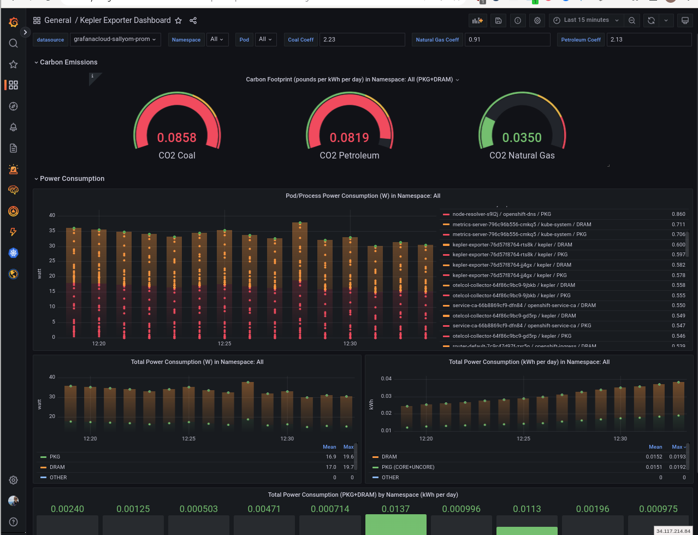

## Kepler on MicroShift in a RHEL based distribution

This assumes MicroShift is installed on a RHEL based machine.
SSH into the virtual machine.

### Execute below commands from within the RHEL machine

#### Start MicroShift service (if not already running)

```bash
sudo systemctl enable --now microshift
mkdir ~/.kube
sudo cp /var/lib/microshift/resources/kubeadmin/kubeconfig ~/.kube/config
sudo chown -R redhat:redhat ~/.kube
oc get pods -A # all pods should soon be running
```

#### Kepler Deployment

Kepler is a research project that that uses eBPF to probe CPU performance counters and Linux kernel tracepoints
to calculate an application's carbon footprint. Refer to [Kepler documentation](https://sustainable-computing.io/) for further information.

> **Note**
> For running in MicroShift on Red Hat Device Edge, I've found it's easiest to use `kustomize` to apply kepler manifests,
> and a standalone OpenTelemetry Collector either with podman or as a sidecar container in the kepler-exporter DaemonSet.
> On other systems where resource constraints are less of a concern, `helm` and `opentelemetry operator` offer convenience.

```bash
git clone https://github.com/sustainable-computing-io/kepler.git
cd kepler
```

#### Modify Kepler manifests for OpenShift

Uncomment the OpenShift lines in `manifests/config/exporter/kustomization.yaml`
(`Line#3` and `Line#16` at time of this writing),
and remove the `[]` in the line `- patchesStrategicMerge: []`. Then, apply
the kepler manifests.

```bash
oc create ns kepler
oc label ns kepler security.openshift.io/scc.podSecurityLabelSync=false
oc label ns kepler --overwrite pod-security.kubernetes.io/enforce=privileged
oc apply --kustomize $(pwd)/manifests/config/base -n kepler

# Check that kepler pod is up and running before proceeding
```

#### Ensure OpenShift CA and otel-collector endpoint on the edge system

```bash
# scp'd files from OpenShift are expected to be in $HOME on the edge system.

ssh redhat@<RHEL_VM>
ls ~/ca.crt ~/edge-token ~/otlp-endpoint
```

### Launch OpenTelemetry Collector to receive and export kepler metrics

The OpenTelemetry Collector can run as a sidecar container to the kepler exporter DaemonSet.
Metrics will be sent from kepler to an OpenTelemetry Collector pod running in OpenShift. From there,
a `prometheusremotewrite` opentelemetry collector exporter will send metrics to a Prometheus pod,
and a Prometheus datasource in Grafana will be used to visualize the data. 

#### Add collector sidecar to kepler exporter daemonset

Run the following to launch an OpenTelemetry Collector sidecar container in the kepler-exporter Daemonset.
Download the opentelemetry config file and modify as necessary to configure receivers and exporters.

```bash
oc create configmap -n kepler client-ca --from-file ~/ca.crt

curl -o microshift-otelconfig.yaml https://raw.githubusercontent.com/redhat-et/edge-ocp-observability/main/edge/sample-app/kepler/microshift-otelconfig.yaml
# the exporter must be configured to match the OTLP receiver running in OpenShift
# replace <otlp_endpoint> with the OpenShift opentelemetry collector route.host

oc create -n kepler -f microshift-otelconfig.yaml

# patch daemonset to add a sidecar opentelemetry collector container
curl -o /tmp/patch-sidecar-otel.yaml https://raw.githubusercontent.com/redhat-et/edge-ocp-observability/main/edge/sample-app/kepler/patch-sidecar-otel.yaml
oc patch daemonset kepler-exporter -n kepler --patch-file /tmp/patch-sidecar-otel.yaml
```

Check that the kepler-exporter now includes an otc-container and that the collector is receiving and exporting metrics as expected.
Finally, [deploy grafana in OpenShift with a prometheus datasource to view the metrics.](#deploy-grafana-and-the-prometheus-datasource-with-kepler-dashboard)

### Deploy Grafana and the Prometheus DataSource with Kepler Dashboard

You can query metrics from your application in OpenShift, `-n observability` with the `thanos-querier route`.
However, you might prefer to view the prometheus metrics in Grafana with the upstream
[kepler exporter dashboard](https://github.com/sustainable-computing-io/kepler/blob/main/grafana-dashboards/Kepler-Exporter.json)

To deploy grafana, prometheus, and the dashboard, run this against the **OpenShift cluster**

```bash
cd edge/sample-app/kepler/dashboard-example-kepler
./deploy-grafana.sh
```

You should now be able to access Grafana with `username: rhel` and `password:rhel` from the grafana route.

* Navigate to Dashboards -> to find Kepler Exporter dashboard.
* Navigate to Explore -> to find the Prometheus data source to query metrics from.

Hopefully, you'll see something like this!


